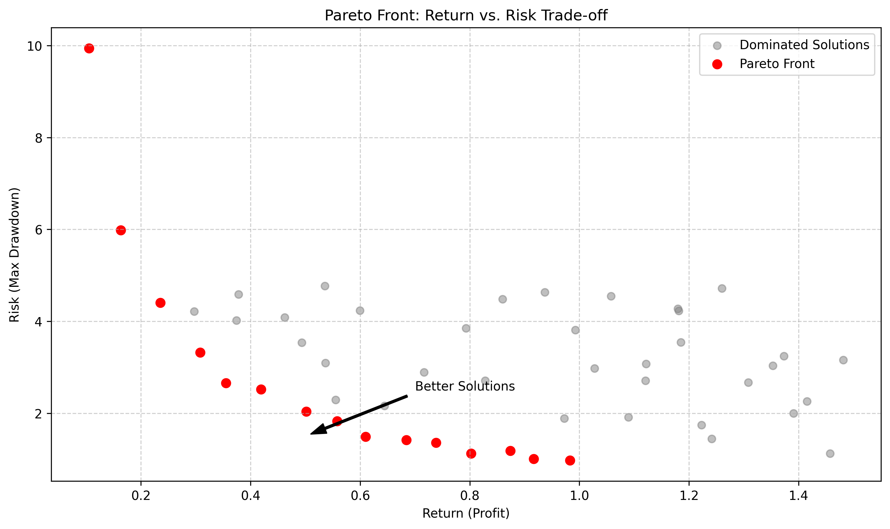
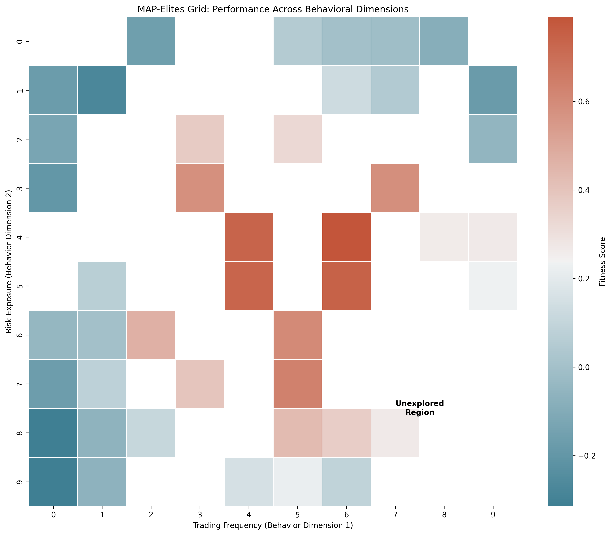

# Nucleotide Strategy Evolution: Evolving Trading Strategies with Genetic Algorithms

<!-- Badges Section -->
<p align="center">
  <a href="https://www.python.org/downloads/"></a>
  <a href="LICENSE"></a>
  <a href="#running-tests"></a>
  <a href="https://black.readthedocs.io/en/stable/"></a>
  <br>
  <a href="#running-tests"></a>
  <a href="#"></a>
  <a href="#contributing"></a>
  <a href="#"></a>
</p>

---

**A Python framework leveraging DNA-based genetic algorithms to discover and evolve robust algorithmic trading strategies.**

## The Challenge & Our Approach

The quest for profitable and reliable trading strategies is fraught with challenges. Manual design is constrained by human intuition and biases, while traditional optimization techniques often fall victim to **overfitting**, creating strategies that look great on historical data but fail dramatically in live markets.

This project tackles these issues using a bio-inspired approach: **Genetic Algorithms (GAs)**. We represent trading strategies not as fixed parameter sets, but as **digital DNA**. This DNA encodes the logic, indicators, risk management rules, and other components of a strategy.

By simulating evolution over generations—selecting successful strategies, recombining their DNA (crossover), and introducing variations (mutation)—the system automatically explores a vast and complex strategy space. The goal is to discover **novel, potentially non-intuitive strategies** that exhibit **robust performance** across different market conditions.

Key differentiators include:
*   **Rich Genetic Representation:** Encoding complex rules and adaptive behaviors directly into the DNA.
*   **Multi-Objective Optimization:** Explicitly optimizing for a *balance* between profitability and risk metrics (e.g., drawdown, Sortino ratio) using algorithms like NSGA-II, leading to a *Pareto front* of trade-off solutions rather than a single "best" strategy.
*   **Diversity Preservation:** Employing techniques like Novelty Search and MAP-Elites to encourage exploration and prevent premature convergence on suboptimal solutions, fostering a population of distinct behavioral archetypes.
*   **Rigorous Validation:** Integrating methods like Walk-Forward Optimization and Purged K-Fold Cross-Validation specifically designed for time-series data to combat overfitting.

## Core Concepts


*   **DNA Encoding (`encoding.py`, `core/structures.py`):**
    *   Strategies are represented as `DNASequence` (strings of A, C, G, T).
    *   Triplet codons (e.g., `ATG`, `GCT`) map to integers (0-63).
    *   These integers are scaled and mapped to specific strategy parameters (indicator periods, thresholds, operator types, risk settings) based on predefined schemas within `encoding.py`.
    *   Genes are functional blocks defined by `START_CODON` (`ATG`) and `STOP_CODONS` (`TAA`, `TAG`, `TGA`).
    *   A `Chromosome` groups multiple `Gene` objects decoded from a single `DNASequence`.
    *   *Regulatory Elements:* Promoter sequences preceding genes can influence their `expression_level`, potentially modulating their impact.
*   **Gene Types (`encoding.py` decoding logic):**
    *   The first codon after `START` determines the `gene_type`.
    *   Subsequent codons define parameters specific to that type (e.g., an `indicator` gene decodes name, period, source; a `risk_management` gene decodes SL/TP modes and values).
*   **Evolutionary Loop:**
    1.  **Initialization (`population/population.py`):** Create an initial `Population` of random `Chromosome` objects.
    2.  **Evaluation (`fitness/evaluation.py`):** Run each `Chromosome` (strategy) through the `backtesting` engine against historical data. Calculate fitness objectives (e.g., net profit, max drawdown).
    3.  **Ranking (`fitness/ranking.py`):** For multi-objective evolution, rank individuals using `fast_non_dominated_sort` and calculate `calculate_crowding_distance` (NSGA-II).
    4.  **Selection (`population/selection.py`):** Choose parent individuals for reproduction based on fitness/rank (e.g., `tournament_selection`, `nsga2_selection`, `lexicase_selection`).
    5.  **Variation (`operators/`):** Create offspring `DNASequence` objects by applying `crossover` (e.g., `single_point_crossover`) and `mutation` (e.g., `point_mutation`, `insertion_mutation`, `gene_duplication_mutation`) operators to selected parents.
    6.  **Replacement:** Form the next generation's population from parents and offspring (often involving elitism).
    7.  **Repeat:** Go back to step 2 for a set number of generations.
*   **Diversity (`population/diversity.py`, `population/map_elites.py`):**
    *   Techniques like *Fitness Sharing* (penalizing genotypically similar individuals) or *Novelty Search* (rewarding unique behavioral characteristics) run alongside fitness evaluation to maintain diversity.
    *   *MAP-Elites* maintains an archive (grid) of high-performing individuals across different behavioral niches (e.g., high-frequency vs. low-frequency strategies).
*   **Island Model (`population/island.py`):** Evolves multiple populations in parallel, periodically migrating top individuals between islands to share genetic material and explore different search space regions.
*   **Validation (`validation.py`):** Provides tools like `generate_wfo_splits` and `PurgedKFold` to create appropriate training/testing splits for time-series data, essential for out-of-sample testing during or after evolution.

## Key Features Summary

*   **Encoding:** DNA/Codon/Gene system, Promoters.
*   **Genes:** Rules (Entry/Exit), Risk (SL/TP), Indicators, Filters (Time/Regime), Order Types, Meta-params.
*   **Operators:** Point/Insertion/Deletion/Codon/Inversion/Translocation/Duplication Mutation, Single-Point/Uniform Crossover.
*   **GA Techniques:** MOO (NSGA-II), Selection (Tournament, NSGA-II, Lexicase), Diversity (Sharing, Novelty, MAP-Elites), Island Model, Adaptive Rates.
*   **Validation:** WFO, Purged K-Fold CV.
*   **Analysis:** Parameter Sensitivity, Gene Freq/Corr, Behavior PCA, Plotting (Pareto, History, QD Grid).
*   **Framework:** Persistence, YAML Config, Packaging, Testing.

## Installation

```bash
# Ensure you have Python 3.11+ installed

# Clone the repository
git clone https://github.com/ChristianJStarr/nucleotide_strategy_evolution.git
cd nucleotide_strategy_evolution

# Create and activate a virtual environment (recommended)
python -m venv .venv
# On Windows: .venv\Scripts\activate
# On macOS/Linux: source .venv/bin/activate

# Install the package and its core dependencies
# This uses the pyproject.toml file
pip install -e .

# To install development dependencies (for testing, linting, notebooks):
pip install -e ".[dev]"
```

**Key Dependencies:** `numpy`, `pandas`, `pyyaml`, `matplotlib`, `plotly`, `seaborn`, `scikit-learn`, `backtesting` (or your chosen engine).

## Basic Usage Example

```python
# Conceptual example (see examples/ for runnable scripts)
import random
from nucleotide_strategy_evolution.population import Population, IslandModel
from nucleotide_strategy_evolution.fitness import MultiObjectiveEvaluator
from nucleotide_strategy_evolution.operators import get_crossover_operator, get_mutation_operator
from nucleotide_strategy_evolution.population import get_selection_operator
from nucleotide_strategy_evolution.backtesting import setup_backtester 
from nucleotide_strategy_evolution.utils import config_loader
from unittest.mock import MagicMock  # For demonstration purposes only

# 1. Configuration
evo_params = {
    'population': {'size': 50, 'dna_length': 500},
    'evolution': {'generations': 20},
    'fitness': {'objectives': ['net_profit', '-max_drawdown']},
    'operators': {
        'crossover': {'type': 'single_point', 'rate': 0.7},
        'mutations': [
            {'type': 'point_mutation', 'rate': 0.05},
            {'type': 'insertion', 'rate': 0.01},
            {'type': 'deletion', 'rate': 0.01}
        ]
    },
    'selection': {'method': 'nsga2'}
}
compliance_rules = {'max_drawdown_pct': 0.2}

# 2. Setup Backtester (Replace with your actual setup)
# In a real implementation:
# backtester = setup_backtester("your_market_data.csv", initial_cash=100000)
# In this example, we use a mock:
backtester = MagicMock()
backtester.run = lambda chromo, rules: MagicMock(hard_rule_violation=False, stats={'net_profit': random.uniform(0,1000), 'max_drawdown': random.uniform(0,0.1)})

# 3. Initialize Population
population = Population(size=evo_params['population']['size'], 
                        dna_length=evo_params['population']['dna_length'])
population.initialize()

# 4. Setup Evaluator, Operators, Selector
fitness_evaluator = MultiObjectiveEvaluator(backtester, objectives=evo_params['fitness']['objectives'])
crossover_op = get_crossover_operator(evo_params['operators']['crossover'])
mutation_ops = [(get_mutation_operator(m_conf), m_conf['rate']) for m_conf in evo_params['operators']['mutations']]
selection_method = get_selection_operator(evo_params['selection'])

# 5. Evolution Loop (Simplified)
num_generations = evo_params['evolution']['generations']
for gen in range(num_generations):
    print(f"\n--- Generation {gen+1}/{num_generations} ---")

    # Evaluate Population (using parallel evaluator method)
    fitness_results = fitness_evaluator.evaluate_population( 
        {i: population.individuals[i] for i in range(len(population))}, 
        compliance_rules, 
        n_jobs=-1 # Use parallel processing
    )
    # Update population fitness scores
    for idx, fitness in fitness_results.items():
        population.set_fitness(idx, fitness)

    # Selection
    parent_indices = selection_method(len(population), population.fitness_scores)
    
    # Create Offspring through crossover and mutation
    offspring = []
    for i in range(len(population) // 2):
        parent1 = population.individuals[parent_indices[i * 2]]
        parent2 = population.individuals[parent_indices[i * 2 + 1]]
        
        # Crossover
        child1_dna, child2_dna = crossover_op(parent1.raw_dna, parent2.raw_dna)
        
        # Mutation
        for mutation_op, rate in mutation_ops:
            if random.random() < rate:
                child1_dna = mutation_op(child1_dna)
            if random.random() < rate:
                child2_dna = mutation_op(child2_dna)
        
        # Create chromosomes from DNA
        offspring.append(Chromosome(raw_dna=child1_dna))
        offspring.append(Chromosome(raw_dna=child2_dna))

    # Replacement with elitism
    population.individuals = offspring[:len(population)]

print("\nEvolution finished.")
```

See the `examples/` directory for more complete and runnable scripts.

## Project Structure

```
nucleotide_strategy_evolution/
├── nucleotide_strategy_evolution/  # Main package source code
│   ├── core/                 # Core data structures (DNASequence, Gene, Chromosome)
│   ├── encoding.py           # Functions for converting DNA <-> strategy parameters
│   ├── genes/                # Gene type definitions and factory functions
│   ├── operators/            # Genetic operators (mutation.py, crossover.py, adaptive.py)
│   ├── population/           # Population management (population.py, diversity.py, selection.py, island.py, map_elites.py)
│   ├── fitness/              # Fitness evaluation logic (evaluation.py, ranking.py)
│   ├── backtesting/          # Abstract interface definition for backtesting engines
│   ├── analysis/             # Tools for post-evolution analysis (robustness.py, gene_analysis.py, behavior_analysis.py)
│   ├── visualization/        # Plotting utilities (plotting.py)
│   ├── validation.py         # WFO and PurgedKFold splitting logic
│   ├── serialization.py      # Saving/loading GA state
│   ├── config_loader.py      # Loading parameters from YAML files
│   └── utils/                # General helper functions, logging setup
├── tests/                    # Contains unit and integration tests mirroring the package structure
├── examples/                 # Runnable scripts demonstrating package features
├── notebooks/                # Jupyter notebooks for experimentation and visualization
├── config/                   # Example YAML configuration files for evolution runs
├── data/                     # Directory for market data
├── pyproject.toml            # Project build/dependency configuration (PEP 621)
├── requirements.txt          # Core dependencies list (alternative format)
├── requirements-dev.txt      # Development dependencies list (alternative format)
└── README.md                 # This file
```

## Running Tests

To run the test suite:

```bash
# Ensure development dependencies are installed: pip install -e ".[dev]"
# From the project root directory:
python -m pytest tests/
```

## Documentation

The project documentation is built using Sphinx. To build and view the documentation:

```bash
# Install documentation dependencies
pip install -e ".[dev]"

# Build documentation
# On Windows:
.\build_docs.ps1

# On Unix-based systems:
chmod +x build_docs.sh  # Make the script executable (first time only)
./build_docs.sh

# View documentation
# Open docs/_build/html/index.html in your browser
```

The documentation includes:
- Installation and quickstart guides
- Core concepts explanations
- User guides for all major components
- API reference documentation
- Examples and tutorials

## Contributing

Contributions are welcome! Please feel free to submit bug reports, feature requests, or pull requests.

Before submitting a PR:
1. Ensure your code follows the project's coding style (Black formatter)
2. Add tests for new functionality
3. Make sure existing tests pass
4. Update documentation as needed

## License

This project is licensed under the MIT License - see the LICENSE file for details.

## Visualizations (Examples)

Here are visualizations generated from sample runs of the framework:

### Pareto Front
Shows the trade-off between different objectives (e.g., Profit vs. Drawdown) for the non-dominated solutions found.



### MAP-Elites Grid
Visualizes the performance of the best individual found for different behavioral niches.



### Metric History
Tracks the evolution of metrics like average fitness or diversity over generations.

